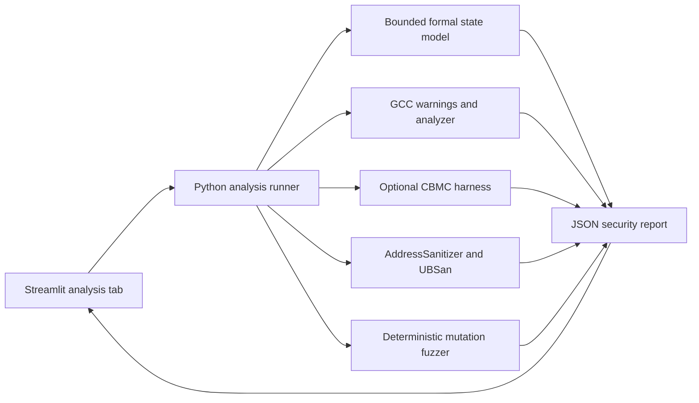
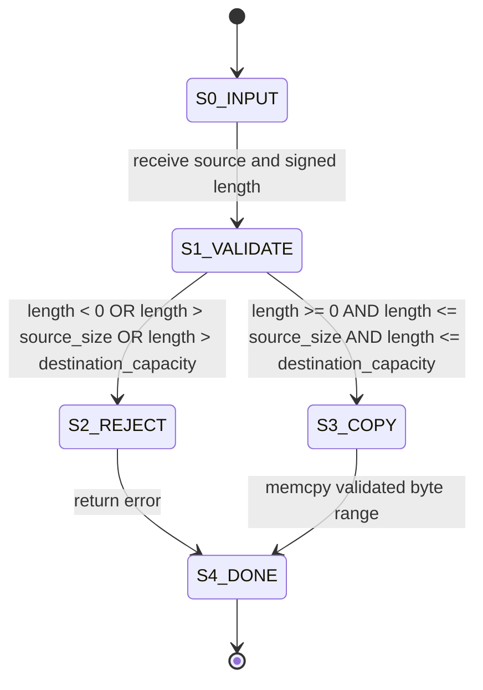
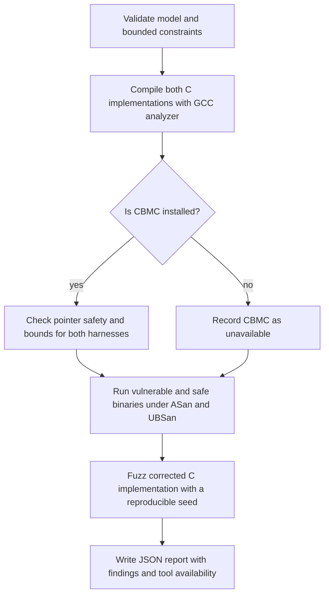

# C Buffer Analysis Flowcharts

## End-to-end data flow

## Buffer-copy state analyzer

The vulnerable teaching example checks only `length > destination_capacity`.
It therefore allows a negative signed length to reach `memcpy`, where the
conversion to `size_t` produces an invalidly large copy length. The corrected
implementation rejects negative lengths before conversion and checks both
source and destination bounds.

## Analysis sequence

